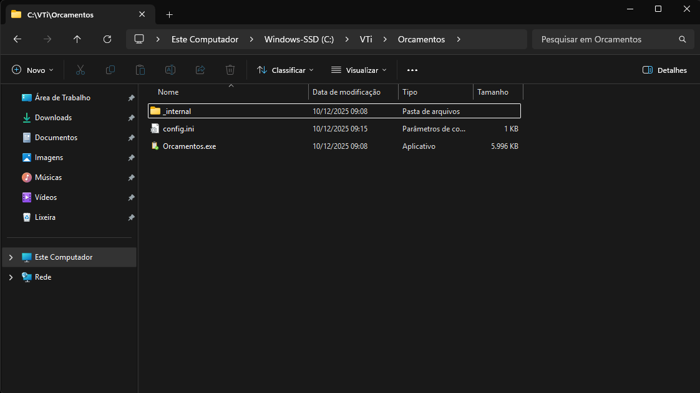
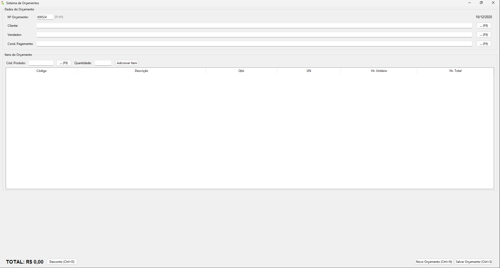
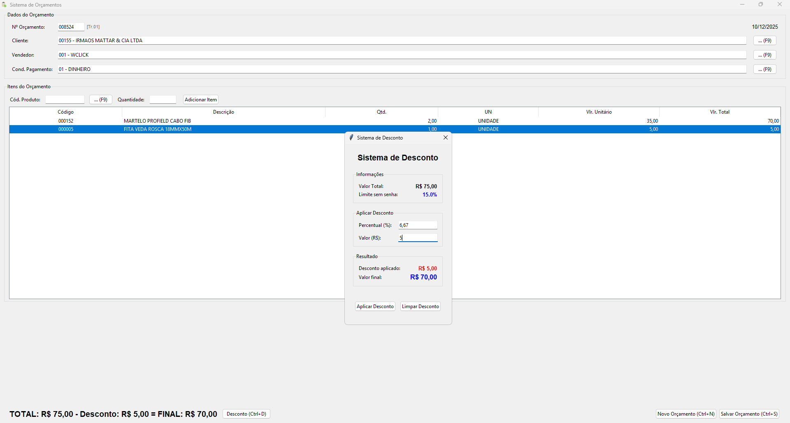
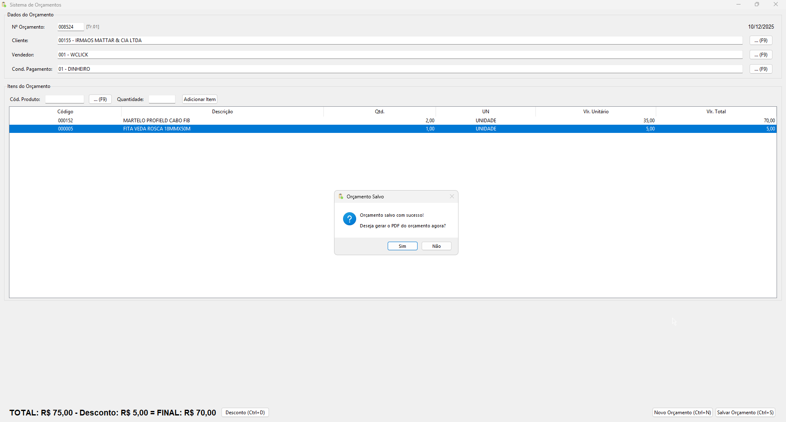
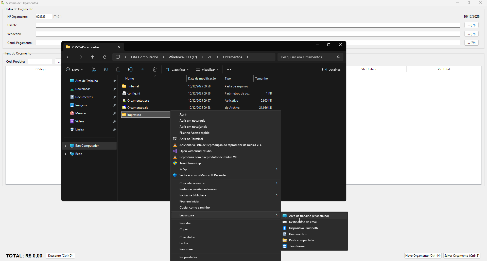
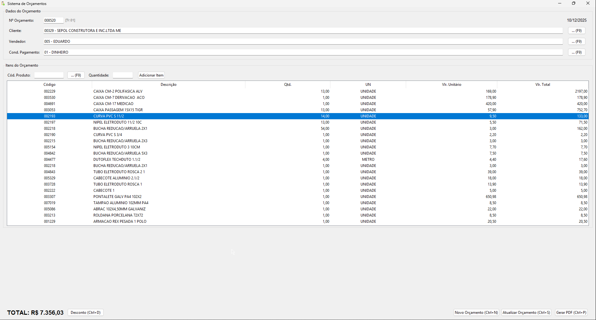
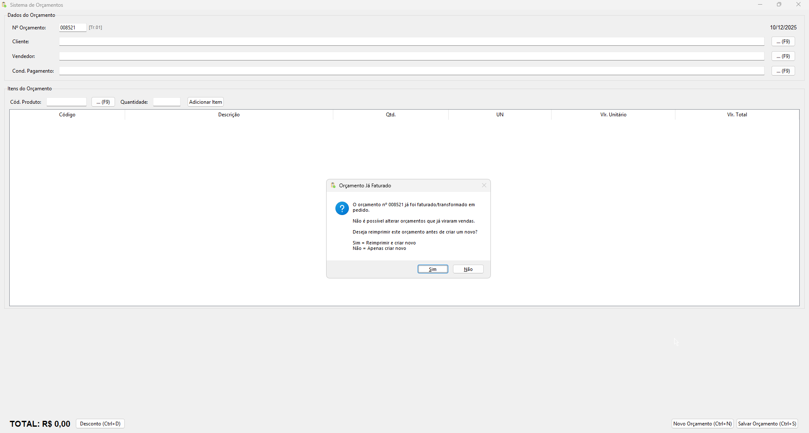

# Orçamentos App

Sistema de orçamentos desenvolvido para atender a necessidade de um cliente que utiliza o sistema VTi.
## Instalação

 - [Link de Download](https://github.com/luisfd3v/orcamentos-app/releases/download/v1.0.0/Orcamentos.zip)

Após fazer o Download, crie uma pasta Orcamentos na pasta raiz do VTi e extraia os arquivos da pasta zip.

Abra o arquivo config.ini na pasta Orcamentos e configure de acordo com os dados de acesso do banco de dados. No arquivo, virá um exemplo pré configurado.

**‼️Importante‼️**

O Arquivo config.ini deve estar sempre na mesma pasta que o executável.
## Uso do Sistema

Ao abrir o sistema, o usuário irá preencher os dados do cabeçalho do orçamento, e adicionar os produtos do orçamento.

O usuário terá a opção de inserir o código manualmente (cliente, vendedor, condição de pagamento, produtos), ou poderá buscar clicando no botão de busca de cada campo (atalho F9).

Depois de incluir os produtos, caso necessário, o usuário consegue alterar a quantidade e o valor unitário dos produtos (clicando duas vezes no campo que deseja alterar).

Também poderá excluir um produto (clicando com botão direito em cima do botão desejado e então clicando em Excluir Item.)

Na tela de desconto, o usuário poderá definir um desconto utilizando uma porcentagem, ou o valor total do desconto. 

O usuário também terá a opção de limpar um desconto dado anteriormente.

Após salvar o orçamento, o sistema irá perguntar ao usuário se deseja gerar o PDF do orçamento para impressão.

Os PDFs gerados ficarão dentro da pasta Impressoes (criada automaticamente caso não exista) na pasta raiz do executável, **recomendo criar um atalho da pasta para área de trabalho do cliente para facilitar o acesso aos PDFs.**

## Outras funções

Além de criar novos orçamentos, o usuário também poderá abrir um orçamento anterior que ainda não foi gerado a nota (faturado / transformado em pedido) no sistema VTi.

Abrindo um orçamento anterior o usuário pode alterar e atualizar o orçamento, ou apenas gerar o PDF dele.

Caso o usuário tente abrir um orçamento já faturado, o sistema irá exibir um aviso e perguntar se deseja gerar um PDF do orçamento, ou começar um novo orçamento.

